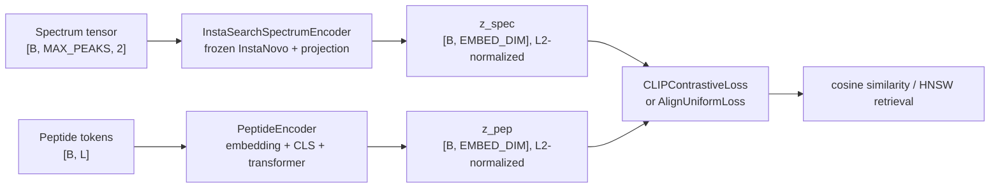

# Dual-Encoder UML

This UML describes the classes used by the current dual-encoder retrieval pipeline:
`InstaSearchSpectrumEncoder` for spectra, `PeptideEncoder` for peptides, shared
projection/transformer components, and the training losses that consume the
two embeddings. `SpectrumEncoder` and `MultiScalePeakEmbedding` are included as
the legacy project-native spectrum tower.

```mermaid
classDiagram
    direction LR

    class nn_Module {
        <<PyTorch>>
    }

    class TransformerEncoderBlock {
        +LayerNorm norm1
        +MultiheadAttention attn
        +Dropout drop1
        +LayerNorm norm2
        +Sequential ffn
        +Dropout drop2
        +__init__(d_model, n_heads, d_ff, dropout=0.1)
        +forward(x, key_padding_mask=None)
    }

    class ProjectionHead {
        +Sequential net
        +__init__(input_dim, hidden_dim, output_dim, dropout=0.1)
        +forward(x)
    }

    class PositionalEncoding {
        +Dropout dropout
        +Tensor pe
        +__init__(d_model, dropout=0.1, max_len=43)
        +forward(x)
    }

    class PeptideEncoder {
        +int pad_idx
        +Embedding aa_embed
        +PositionalEncoding aa_pos_embed
        +Parameter cls_token
        +ModuleList layers
        +LayerNorm final_norm
        +ProjectionHead proj_head
        +__init__(vocab_size=NUM_AA, pad_idx=0, d_model, n_heads, d_ff, n_layers, embed_dim, max_len, dropout)
        +forward(tokens)
    }

    class InstaSearchSpectrumEncoder {
        +InstaNovo instanovo
        +bool freeze_encoder
        +str pool_mode
        +Sequential proj_head
        +__init__(instanovo_model, d_instanovo, embed_dim, freeze_encoder=True, pool_mode="mean", dropout)
        +train(mode=True)
        +_run_backbone(x, precursors, x_mask)
        +forward(x, precursors, return_peak_representations=False)
    }

    class MultiScalePeakEmbedding {
        +int h_size
        +dtype float_dtype
        +Sequential mlp
        +Sequential head
        +Tensor freqs
        +__init__(h_size, dropout=0, float_dtype=torch.float64)
        +forward(spectra)
        +encode_mass(x)
    }

    class SpectrumEncoder {
        +int MAX_CHARGE
        +MultiScalePeakEmbedding peak_encoder
        +Embedding charge_embedding
        +Linear precursor_proj
        +Parameter cls_token
        +ModuleList layers
        +LayerNorm final_norm
        +ProjectionHead proj_head
        +__init__(d_model, n_heads, d_ff, n_layers, embed_dim, dropout)
        +_encode_precursor(precursors)
        +forward(x, precursors)
    }

    class CLIPContrastiveLoss {
        +Parameter log_temp
        +float label_smoothing
        +__init__(init_temp, label_smoothing=0.1)
        +forward(z_spec, z_pep, z_decoy=None, **_)
    }

    class AlignUniformLoss {
        +float alpha
        +float t
        +float lam
        +float lam_var
        +float decoy_weight
        +float decoy_margin
        +__init__(alpha=2.0, t=2.0, lam=1.0, lam_var=1.0, decoy_weight=0.3, decoy_margin=0.2)
        +variance_loss(z)
        +forward(z_spec, z_pep, z_decoy=None)
    }

    nn_Module <|-- TransformerEncoderBlock
    nn_Module <|-- ProjectionHead
    nn_Module <|-- PositionalEncoding
    nn_Module <|-- PeptideEncoder
    nn_Module <|-- InstaSearchSpectrumEncoder
    nn_Module <|-- MultiScalePeakEmbedding
    nn_Module <|-- SpectrumEncoder
    nn_Module <|-- CLIPContrastiveLoss
    nn_Module <|-- AlignUniformLoss

    PeptideEncoder *-- PositionalEncoding
    PeptideEncoder *-- TransformerEncoderBlock
    PeptideEncoder *-- ProjectionHead

    InstaSearchSpectrumEncoder o-- ProjectionHead : equivalent MLP
    InstaSearchSpectrumEncoder ..> "InstaNovo._encoder" : frozen backbone

    SpectrumEncoder *-- MultiScalePeakEmbedding
    SpectrumEncoder *-- TransformerEncoderBlock
    SpectrumEncoder *-- ProjectionHead

    CLIPContrastiveLoss ..> InstaSearchSpectrumEncoder : z_spec
    CLIPContrastiveLoss ..> PeptideEncoder : z_pep
    AlignUniformLoss ..> InstaSearchSpectrumEncoder : z_spec
    AlignUniformLoss ..> PeptideEncoder : z_pep, optional z_decoy
```

## Data Flow



## Source Map

- `src/models/insta_search_spectrum_encoder.py`: current spectrum tower.
- `src/models/peptide_encoder.py`: current peptide tower.
- `src/models/joint_model.py`: shared transformer block and projection head.
- `src/training/loss.py`: symmetric CLIP-style contrastive loss.
- `src/training/align_uniform_loss.py`: alignment, uniformity, variance, and optional decoy-margin loss.
- `src/models/spectrum_encoder.py`: legacy trainable spectrum tower.
